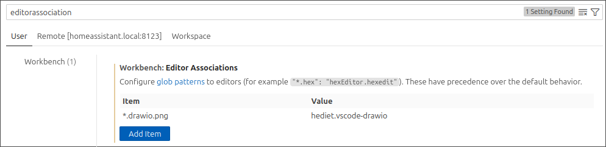
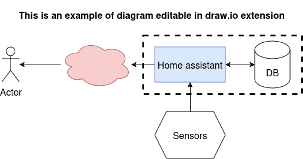

# FAQ

## Tips and tricks

??? "Edit documentation with VSCode addon"

    The installation of this add-on is pretty straightforward and not different in comparison to installing any other Home Assistant add-on.

    1. Click the Home Assistant My button below to open the add-on on your Home
    Assistant instance.

    

    1. Click the "Install" button to install the add-on.
    1. Start the "Studio Code Server" add-on.
    1. Check the logs of the "Studio Code Server" add-on to see if everything went
    well.
    1. Click the "OPEN WEB UI" button to open Studio Code Server.

??? "Create diagrams with draw.io in VSCode"

    [Draw.oi](https://www.drawio.com/) is a web application allowing to create diagrams.

    A [VSCode extension](https://open-vsx.org/extension/hediet/vscode-drawio) dedicated to VSCode allow to edit diagram directly in VSCode.

    To directly see your diagrams in MkDocs, it is recommanded to :
    
    * Configure draw.io extension to associate `.drawio.png` extension to draw.io extension
      
    * Create diagrams ending with the extension `.drawio.png`. It is editable in VSCode and visible in Mkdocs.
      

